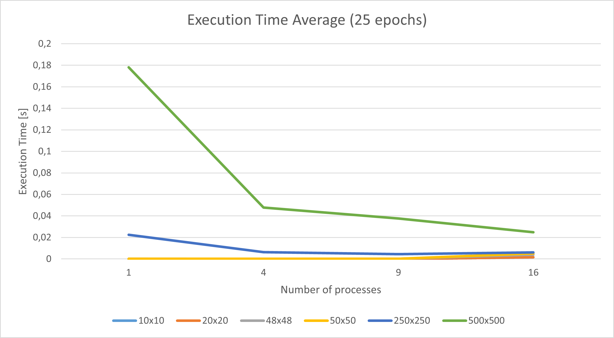
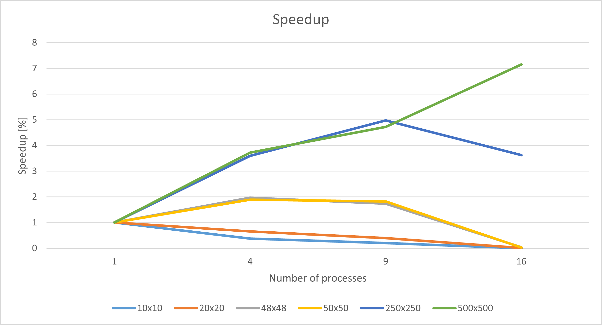
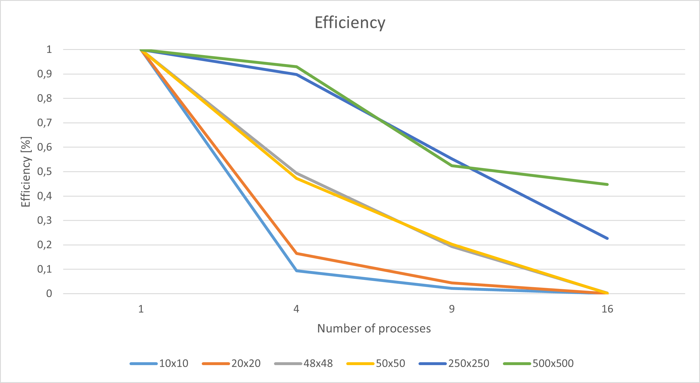

# cannon-matrix-multiplication implementation

## input file format

    <number of rows> <number of columns>
    <data> <data> ... <data> # <number of columns> elements - integers
    ...
    <data> <data> ... <data> # <number of rows> row elements - integers

## benchmarking

Note: compiled with mpicc -o3 on Ubuntu

This plot depicts how the cannon-matrix-multiplication algorithm performs on input datasets (matrices) of 10x10, 20x20, 48x48, 50x50, 250x250, and 500x500 elements if the task is paralellized on a grid of size 1, 4, 9, or 16. In the case of small matrices ( <= 50x50 elements) we can see that no optimization is generated by parallelization. This suggessts that the input size is too small and the best setup for running this algorithm is in sequential mode. Using larger matrices (250x250 or 500x500) we see a real improvement gained from parallelization. Upgrading the sequential implementation with grid capabilities (i.e. moving from 1 process to a 2x2 grid) generates a great decrease in execution time implying that a non-negligible upgrade is gained from using a grid.

Moreover, the plot tells us that the sizes of the datasets we used during benchmarking are not quite appropriate for deciding a range of optimal values for the input. We see that a multiplication of two 500x500 matrices is definitely in that range, and we can assume that the execution time decreases for larger matrices. It is worth noting that the greatest decrease in execution time happens when the sequential implementation is dropped for a grid implementation; increasing the size of the grid improves the execution time, but the improvement is one order of magnitude smaller. Smaller matrices are not target inputs of Cannon's algorithm.

This plot depicts the speedup generated by distributing the work to 1, 4, 9, or 16 workers. As expected, for smaller datasets (<= 20x20), there is no speedup, the execution time increases as the communication introduces overhead that is not mitigated by work parallelization. For "medium" input (48x48 or 50x50) we see the speedup is 200% for 2x2, or 3x3 grids, but as the grid size increases, the overhead fails to be mitigated quickly. For the larger datasets (250x250, 500x500) it is obvious that dividing the work to parallel workers generates great spedup (500%, even 700%). We see that the 250x250 series will not improve with a greater number of workers, but for the larger, 500x500 dataset, the speedup seems to grow if more workers would be added. This suggests that for even larger datasets, speedup gains would be close to linear. This property suggests that the workers are used efficiently. We are interested in finding the global maximum of each series so that the execution time is diminished.

This plot depicts the resource usage, i.e. how much each worker (CPU) is used with respect to its full potential (1 = 100% - maximum utilization). We see that with more workers, the efficiency drops, this means that workers spend decreasingly less time to do the actual task, and more in blocking/waiting stages (sending/receiving data, idling for data). We see that the efficiency drops quick for small datasets meaning that we are wasting resources. Moreover, the descending trend points to resource contention. For large datasets we see what we desire: moving from no parallelism to the grid preserves the efficiency to > 90%, being followed by a consistent heavy decrease towards 0. It is worth noting that using a larger dataset means the slopes of the lines become smaller. As stated above, this points to larger datasets generating even better performance.

The conclusion is that the executable is dataset-size-sensitive: we expect high efficiency for high workloads, but inefficiency for small ones.