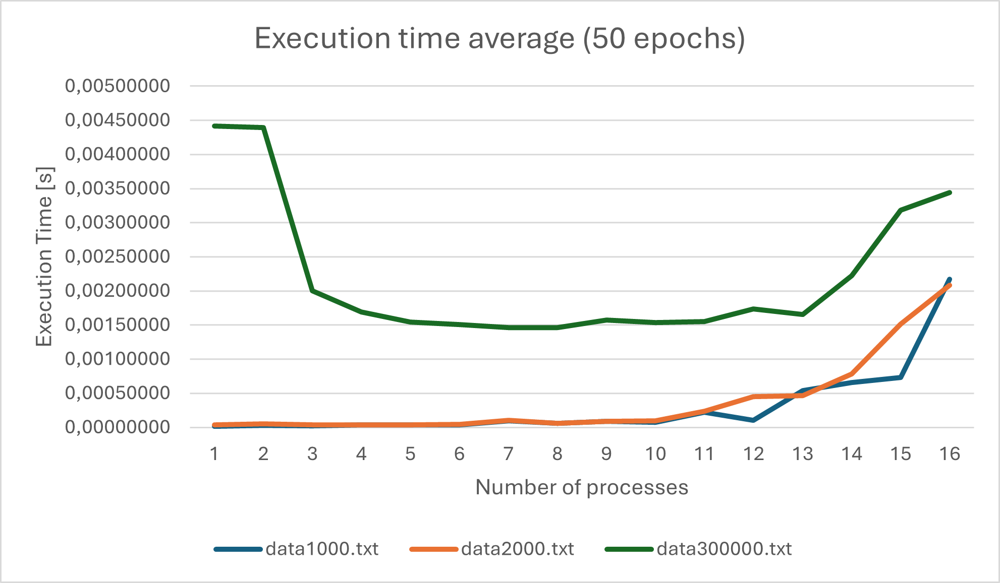
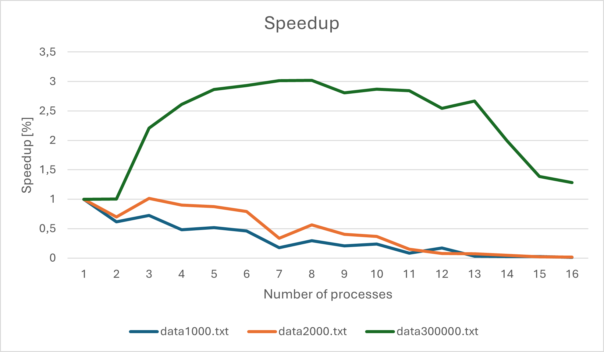
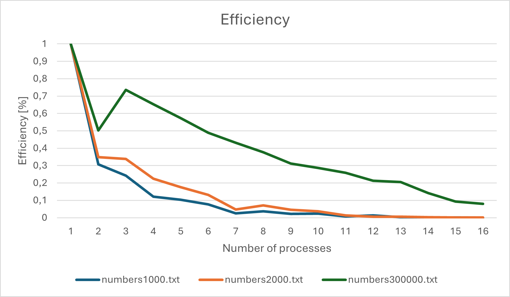

# count-min-sketch implementation

## input file format

    <number of elements>
    <element>
    <element>
    ...
    <element> # <number of elements> elements

## benchmarking results

Note: compiled with mpicc -o3 on Ubuntu

This plot depicts how the count-min-sketch algorithm performs on input datasets of 1000, 2000 and 300000 elements if the task is paralellized on 1, 2, ... 16 processes. In the case data1000.txt and data2000.txt we can see the execution time grows slowly with respect to the number of processes being smaller than 10. Ideally we want the execution time to decrease with the number of workers, so this is undesired behavior. Furthermore, for a greater number of workers (> 10) we see that the series grow linearly. This means that the overhead introduced by message passing kills any optimization as more time is needed to set up a worker than to execute the count-min-sketch algorithm. In the case of the larger dataset (300000 elements) we see the desired behavior: the execution time decreases with the number of processes (1, 2, ... 5), stabilizes (6, 7, 8) and starts growing (9, 10, ... 16). In other words, allocating more workers to do the task in parallel is an improvement until communicating to the workers requires more time than the task itself. Deciding how many workers we need to achieve the best speedup is a matter of finding the global minimum for each series: series1000.txt and series2000.txt require no parallelization to finish as soon as possible; series300000.txt is processed the fastest if 8 parallel workers are allocated. A remark on the sudden valleys that break the decreasing or increasing trend of the series (eg. data1000.txt, has a valley at 11): the execution time is influenced by the partitioning of data to the workers – if workers do not receive balanced inputs, the benchmarking registers such valleys (eg. cont’d. data1000.txt consists of 1000 elements 1000 mod 11 = 10, 1000 mod 12  = 4, 1000 mod 13 = 12, the input is better partitioned at 12, thus an improvement over both its neighbors is recorded). These valleys are mitigated by the iterative benchmarking process (in this case, 50 epochs + 2 second CPU cooling time).

This plot depicts the speedup generated by distributing the work to 1, 2, ... 16 workers. As expected, for small datasets (data1000.txt and data2000.txt), there is no speedup, the execution time increases as the communication introduces overhead that is not mitigated by work parallelization. For the larger dataset (data300000.txt) it is obvious that dividing the work to parallel workers generates great spedup (3, 4, 5, ... 8) – peaking at 3 times faster than sequential execution. When the number of workers introduces too much communication overhead, the speedup gain decreases (11, 12, ... 16). We are interested in finding the global maximum of each series so that the execution time is diminished. Note: valleys in the Execution Time Plot become peaks in this plot.

This plot depicts the resource usage, i.e. how much each worker (CPU) is used with respect to its full potential (1 = 100% - maximum utilization). We see that with more workers, the efficiency drops, this means that workers spend decreasingly less time to do the actual task, and more in blocking/waiting stages (sending/receiving data, idling for data). We see that the efficiency drops quick for small datasets meaning that we are wasting resources. Moreover, the descending tred points to resource contention. The conclusion is that the executable is dataset-size-sensitive: we expect high efficiency for high workloads, but inefficiency for small ones.
