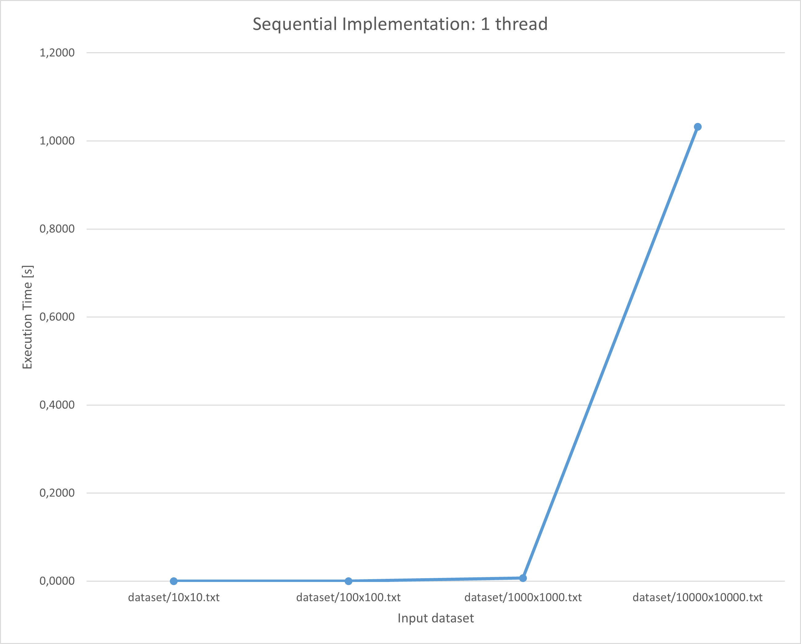
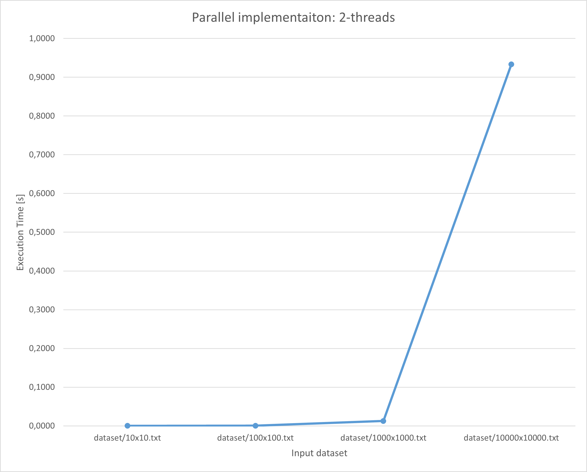
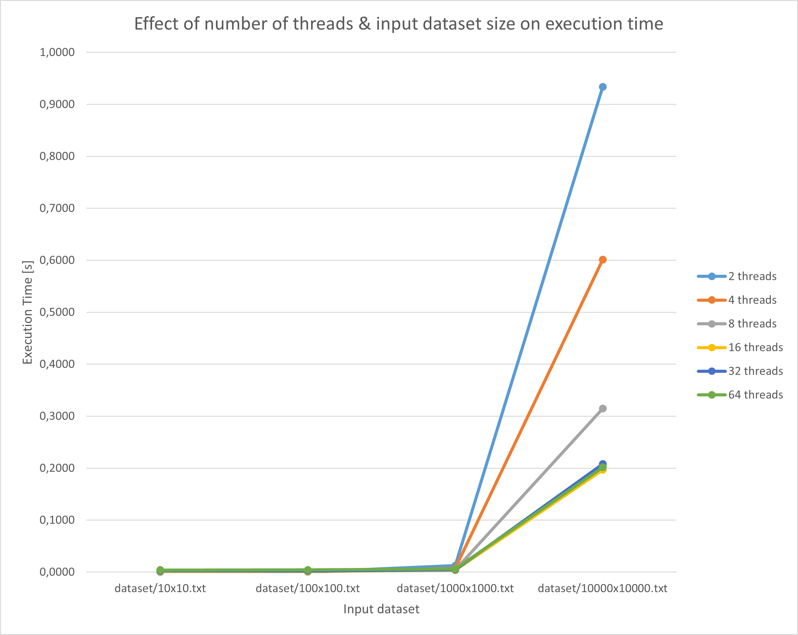
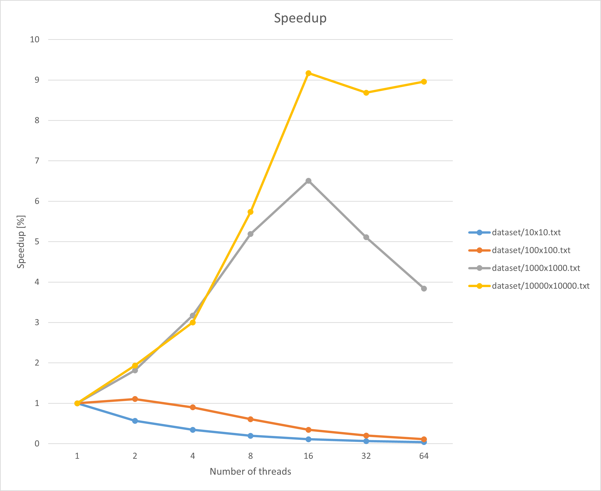
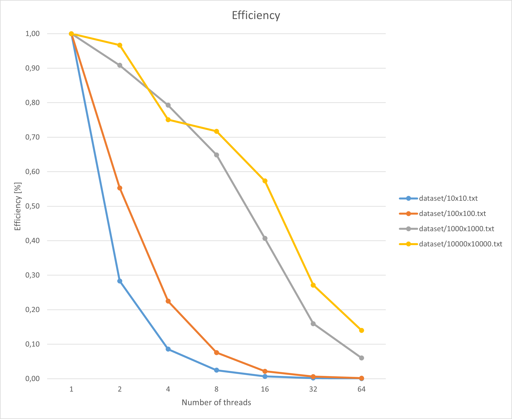
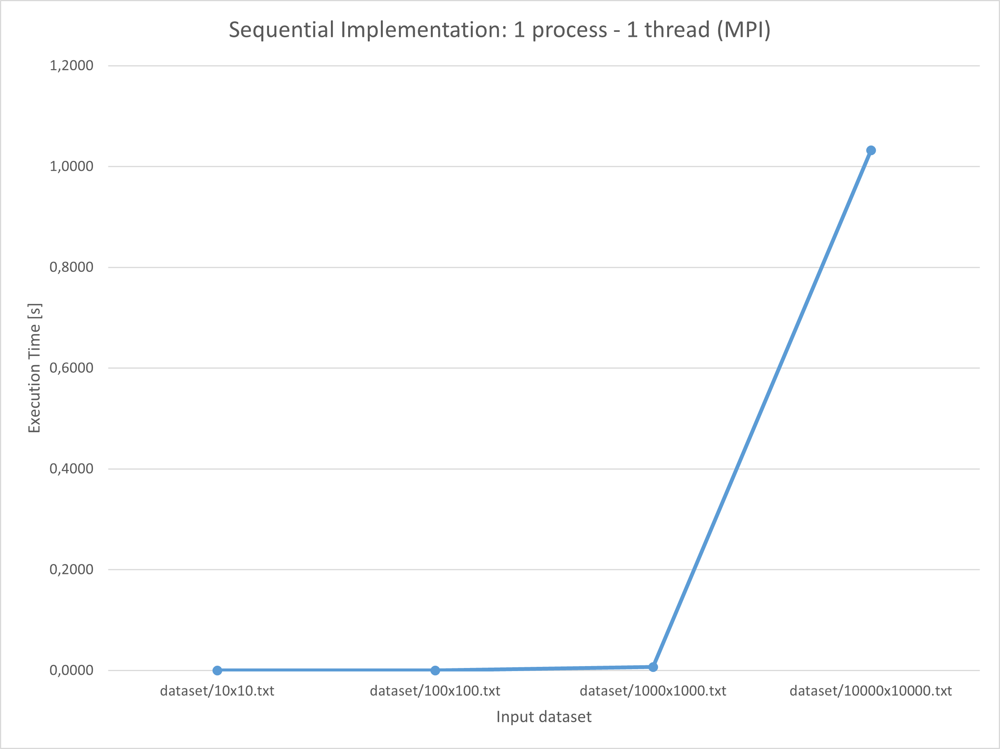
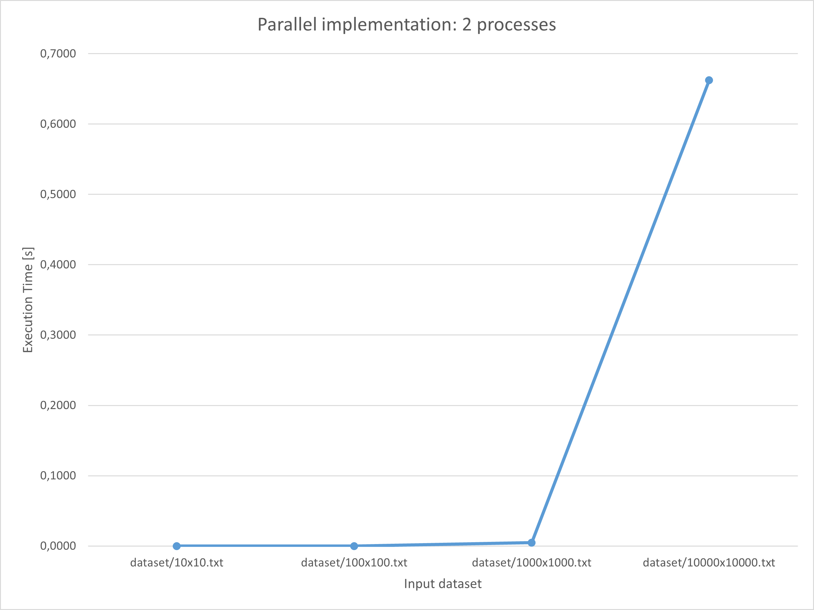
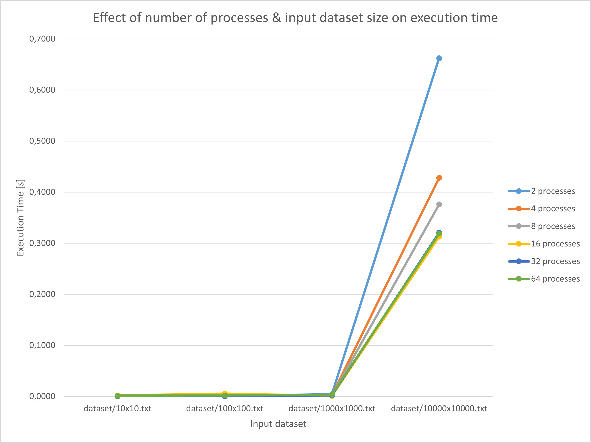
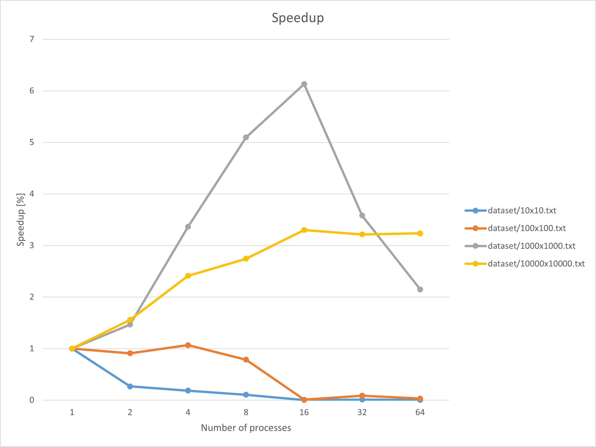
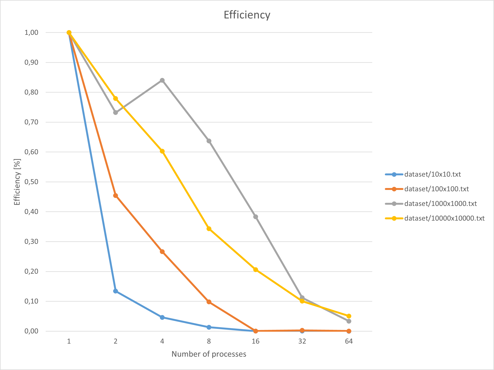

# kernel solver

## input file format

    <number of rows> <number of columns>
    <element> <element> ... <element> # <number of columns> elements - floats
    <element> <element> ... <element>
    ...
    <element> <element> ... <element> # <number of rows> rows

## benchmarking results

Note: compiled with `mpicc -o3` / `g++ -o3`  on Ubuntu

Results are compiled out of `25` epochs.

### shared memory implementation

The above 2 plots highlight the time required to reach convergence in the case of the shared memory implementation: sequential approach (one thread) vs mulitthreaded approach (2 threads). We see that for the largest dataset used the execution time decreases by about 0.2 seconds.

This plot extends the discussion the previous plots started. We note that on a large dataset, a larger number of threads yields better results. We must remark that jumping from 16 to 64 threads provides no relevant improvement. Furthermore, balanced workloads seem to improve the overall outcome (perfect balance is achieved for 16 threads - 1 thread is assigned 625 rows - which generates the best execution time for that input dataset).

As expected, increasing the number of threads for small datasets yields performance penalties. For larger datasets, however, the improvement is massive (7 to 9 times faster!). We note that the better the work is balanced around the worker threads, the better (note the valley in `dataset/10000x10000.txt` at `Number of threads=32`).

This plot depicts the efficiency we obtain for all benchamrked configurations. As expected, it trends towards 0 with more resources allocated. Smaller datasets do not benefit at all from resource allocation, but we remark that for larger datasets, reasonable good values are registered until `Number of threads=16`. Cumulated with the above discussion, it generally points to a sweet spot in terms of efficiency-speedup tradeoff.

### distributed implementation

The above plots highlight the difference in terms of execution speed between the sequential (1 process - 1 thread) and the parallel (2 processes - 1 thread each) implementation. As expected, more processes yield a better execution time (roughly 0.3 seconds).

This plot summarizes the effect of using multiple processes to solve the task represented by a specific dataset. As expected, smaller dataset do not benefit from vertical scaling, however, on larger datasets we halved the execution time by quadrupling the number of processes. Moreover, we remark that a square grid (implicitly better load balancing) positively impacts the execution time more than doubling the number of processes.

This plot depicts the speedup and highlights that large datasets benefit from vertical scaling. We remark that for the largest dataset `dataset/10000x10000.txt` the speedup stabilizes starting `16` processes. This may be a limitation of the machine we have conducted benchmarking on. Smaller datasets do not benefit from large available resource pools.

The efficiency complements the speedup plot by providing valuable information about the resource usage. As expected, it follows a decreasing trend, however, note this tred is steeper than the trend in the shared memory implementation. This is caused by inter process communication.